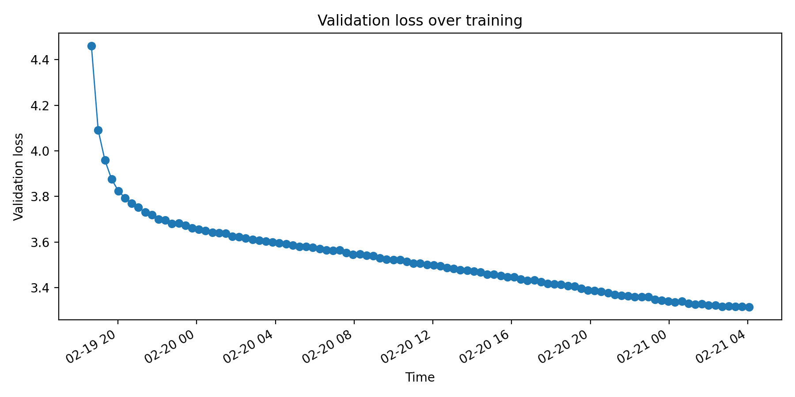

## look_at_cc
a. this page is http://0371rykj.com/ipfhsb/34.html, and is not accessable now, the content of this page is a production introduction page.

b. filter by title/h1/p/li/... tags, this text is low quality, only one continous sentence in the full page, most of the text are independent phrase, and has a harmful title. what is `恒溫恒濕試驗箱` and the structure of production information page, probably.

c. Yes. this example would be useful in training DOM Understanding and B2B SEO/SEO spam detection, would be useless in training conversational AI or natural language understanding systems.

d. Chinese/English/Dutch/Greek, Bussiness/Adult/Blog/Library/Politics/..., after about 70+ pages i seen a high-quality webpage.

## extract_text

b. text extracted by my function is not well formated and has many tags like th/ul/.. not removed. the wet file is better.

## language_identification
b. some language identified failed (misclassification) or some languages mixed usaged. mitigating these issues requires robust language identification, probability of all label or a suitable classifier confidence threshold.

c. the 49th WARC responce is contaminated, is classified as fr(0.2117), but i think it's English. a suitable classifier confidence threshold is 0.6.

## mask_pii
4. some personal identifiable information is hard to filter like address or real name, and this mask will invalid in unformated/raw data, like the format of ip is ipv6, the email use # instand of @, and the phone is just a number not the real phone number or the phone number in other country. it is hard to mitigate this issues, prehaps we can try a model based filter.

5. too many failed case, like 
```
http://www.56.com/n_v162_/c50_/22_/19_/lily_zl_/126612472712hd_/648000_/0_/49549788.swf
masked as
http://www.56.com/n_v162_/c50_/22_/19_/lily_zl_/|||PHONE_NUMBER|||12hd_/648000_/0_/49549788.swf
```

## harmful_content
3. apply nsfw and toxic filter will cause distribution shift and semantic loss. mitigations include using graded or soft labels instead of hard removal, adding context-aware review.

4. many calssify error like the first page's title and got "non-nsfw" with 1.0 confidence, the classifier seems not works with chinese.

## gopher_quality_filters
2. the `USNCCM 13` page is filter out by mean length 2.73 < 3.0, but i think the quality is ok.

## filter_data
2. ~12 hours for 5000 WET files with 48 aarch64 cores and 200 GB memory, line exact dedup takes 2/3 of the time. ~10 days for 100k files.

## inspect_filtered_data
1. 
```
MOOCs | brushfiresales site
==============================xxx  RECORD 1  xxx==============================
Announcing the Killer Tribes Conference – Bryan Allain
Announcing the Killer Tribes Conference
Posted on November 30, 2011 by Bryan
Well…this is probably the biggest, scariest thing I’ve done since I drank an entire glass of water at 10pm as a bed-wetting 12-year old at a sleepover at my friend Seth’s house.
Let’s hope it turns out better than that night did.
Ladies and Gentleman, introducing the Killer Tribes Conference…
Registration is live, and time is already running out on the Super Early Bird rate. Can’t wait for you to meet these presenters, and can’t wait to tell you who else is on the verge of joining the lineup. For more info, visit the conference web site: The Killer Tribes Conference
If you’re a blogger, writer, artist, pastor, small business owner, or anyone else looking to expand their reach, find their fans, & build a killer tribe, THIS CONFERENCE IS FOR YOU.
This is going to be so much fun I might pee in my pants…and boy, wouldn’t that be life coming full circle?
Can’t wait to see who the first few folks are who jump on board and get tickets. Stay tuned…
December is Make Your Goal Month!
Fake or Real?
==============================xxx  RECORD 2  xxx==============================
PHYS 340A - Electricity and Magnetism I -
PHYS 340A - Electricity and Magnetism I
Prerequisites: PHYS 152 , PHYS 310 .
Prerequisite/Corequisite: MATH 370A or MATH 364A .
Vector calculus, electrostatics, and magnetostatics. Formulation of Maxwell’s equations in vector analytic form.
Letter grade only (A-F). (Lecture-discussion 3 hrs.)
==============================xxx  RECORD 3  xxx==============================
Pricing for Collaboration Between Online Apps and Offline Venues | DeepAI
Pricing for Collaboration Between Online Apps and Offline Venues
by Haoran Yu, et al.
An increasing number of mobile applications (abbrev. apps), like Pokemon Go and Snapchat, reward the users who physically visit some locations tagged as POIs (places-of-interest) by the apps. We study the novel POI-based collaboration between apps and venues (e.g., restaurants). On the one hand, an app charges a venue and tags the venue as a POI. The POI tag motivates users to visit the venue, which potentially increases the venue's sales. On the other hand, the venue can invest in the app-related infrastructure, which enables more users to use the app and further benefits the app's business. The apps' existing POI tariffs cannot fully incentivize the venue's infrastructure investment, and hence cannot lead to the most effective app-venue collaboration. We design an optimal two-part tariff, which charges the venue for becoming a POI, and subsidizes the venue every time a user interacts with the POI. The subsidy design efficiently incentivizes the venue's infrastructure investment, and we prove that our tariff achieves the highest app's revenue among a general class of tariffs. Furthermore, we derive some counter-intuitive guidelines for the POI-based collaboration. For example, a bandwidth-consuming app should collaborate with a low-quality venue (users have low utilities when consuming the venue's products).
==============================xxx  RECORD 4  xxx==============================
As the race for Bogota’s mayor heats up, who is closest to the prize?
Next month is Bogotá local election time – nationwide campaigns for local mayors, governors, council and assembly members are hottin
g up
Elections for governors of each of Colombia’s 32 departments and officials in over a thousand municipalities, as well as the Mayorship of Bogota, will take place on October 25.
With just under two months to go, there are three clear front runners in the Bogota mayoral race. The most recent Gallup poll, released on August 25, put Peñalosa in the lead with 24.2%, followed by Pardo at 22.5%, and López with 21.1%. Pacho Santos, of Centro Democratico, was trailing with 13.4% and another independent candidate, María Mercedes Maldonado had just 3.4%.
Both the Gallup poll and a survey by ProBogota put security as the most pressing issue, with analysis on leading political website La Silla Vacía showing that, although the rate of homicides in the city has decreased, both theft and the feeling of insecurity are on the up.
The elections take place against concern over manipulation of votes, high abstention rates and threats against candidates.
An Ombudsman ‘early warning’ report stated that 268 municipalities throughout the country were at risk of pressure or intimidation from armed groups, down from 356 in 2011. The demobilised paramilitary group, United Self Defence Forces of Colombia (AUC) presented a threat in 156 districts, FARC in 128 and the ELN in 79.
More worryingly, it also identified 106 acts of violence, including six murders of candidates or close relatives and six murders of public officials.
At a meeting of the National Election Commission on September 1, the Minister of the Interior, Juan Fernando Cristo committed to reinforcing security in the 268 districts that are at risk.
The minister also said that they would tackle the issue of voting irregularities – saying that more than 20% of new registrations were fraudulent.
“There are between 800,000 and one million registered cédulas in which the information doesn’t match the SISBEN or FOSYGA [legal] properties for the municipality where they are registered.”
Enrique Peñalosa is a 60-year-old Colombian-American politician. He has already served one term as mayor of Bogota, from 1998 to 2000. In his time as mayor he was famous for big projects, most famously introducing the Transmilenio. He is running independently in this election but is supported by Cambio Radical and Partido Conservador. Clara López is a 65-year-old Harvard-educated economist. From 2008 to 2010, she served as secretary of government for the mayor’s office in Bogota. She was also elected as acting mayor of Bogota in 2011 from June-December. In 2014 she ran for presidency for the Polo Democrático party and is a left-wing politician.
Rafael Pardo is the mayoral candidate for the Liberal party. The 61-year-old economist has worked as the Minister of Labour under Santos’ government and served 1 month as mayor in 2014 after Petro was temporarily removed as mayor. In 2010, he was a senator and presidential candidate for the Liberal Party of Colombia. Francisco ‘Pacho’ Santos is a 54-year-old right wing politician and journalist educated in communications in the USA. He is the youngest mayoral candidate in the running, representing Centro Democrático, which is currently led by ex-president Álvaro Uribe. He’s also current president Juan Manuel Santos’ cousin.
Bogota mayor elections
==============================xxx  RECORD 5  xxx==============================
```

record sames low quality, and other sames ok.

2. 
```
Spent time - Report - akiron
⚲
Project
General
Profile
Sign in
Register
Home
Projects
Help
Search:
Jump to a project...
All Projects
akiron
Projects
Activity
Issues
Spent time
Gantt
Calendar
News
Spent time
Filters
Add filter Project Issue User Activity Comment Hours Date Issue's Tracker Issue's Status
Options
Columns
Available Columns
Week Tracker Status
Selected Columns
Project Date User Activity Issue Comment Hours
Group results by Project Date User Activity
Totals Hours
Apply Clear
Details
Report
Details : Year Month Week Days Add : Project Status Version Category User Tracker Activity Issue Clear
Loading...
Powered by Redmine © 2006-2017 Jean-Philippe Lang

==============================xxx  RECORD 1 END  xxx==============================
Forum Quark! - Frequently Asked Questions
Forum Quark!
Quark! - Escola de Física para Jovens da UC
Skip to content
Search
Advanced search
Quick links
Unanswered topics
Active topics
Search
FAQ
Login
Board index Frequently Asked Questions
Search
Frequently Asked Questions
Login and Registration Issues
Why do I need to register?
What is COPPA?
Why can’t I register?
I registered but cannot login!
Why can’t I login?
I registered in the past but cannot login any more?!
I’ve lost my password!
Why do I get logged off automatically?
What does the “Delete cookies” do?
User Preferences and settings
How do I change my settings?
How do I prevent my username appearing in the online user listings?
The times are not correct!
I changed the timezone and the time is still wrong!
My language is not in the list!
What are the images next to my username?
How do I display an avatar?
What is my rank and how do I change it?
When I click the email link for a user it asks me to login?
Posting Issues
How do I create a new topic or post a reply?
How do I edit or delete a post?
How do I add a signature to my post?
How do I create a poll?
Why can’t I add more poll options?
How do I edit or delete a poll?
Why can’t I access a forum?
Why can’t I add attachments?
Why did I receive a warning?
How can I report posts to a moderator?
What is the “Save” button for in topic posting?
==============================xxx  RECORD 2 END  xxx==============================
Shop Now
One of the best appliances for a small kitchen is a stylish fridge that holds a lot of food. This GE refrigerator fits the bill. This 11.9-cubic-foot fridge in fingerprint-resistant stainless steel features a Quick-Space shelf that functions as a normal full-sized shelf when needed. It’s the same depth as a standard counter, giving it a built-in look.
“This was bought to replace one twice as big,” says one reviewer on The Home Depot web site. “The shelving makes it hold a lot of food, and the digital settings are very accurate. We are completely off grid solar, and this model should be marketed to all solar homes. At 1.6 amps it draws less than half the current of most refrigerators. And whisper quiet as well.”
via merchant
GE Electric Wall Oven
Shop Now
A small kitchen needs appliances that combine functionality, compactness and aesthetics. This sleek, 24-inch GE Electric Wall Oven features a 2.7 cu. ft. capacity and many extras found in larger ovens —electronic touch pad oven controls, adjustable self cleaning levels, sabbath mode, and multiple oven racks and positions.
“Purchased this wall oven to replace a deteriorating 35-year-old unit made by a different manufacturer.’, writes one Lowe’s reviewer. ” This GE oven is exactly what I need. It fits the space perfectly, has all the features I need and more, is attractive insofar as ovens go, and was reasonably priced. Installation was smooth. The oven performs perfectly.”
via merchant
Fridgidaire Built-In Dishwasher
Shop Now
This small but mighty dishwasher from Frigidaire will save you valuable kitchen space while ensuring your kitchen sink doesn’t stack up with dishes. The Frigidaire Front Control 18-inch Built-In Dishwasher offers energy-efficient washing and drying options, a 24-hour delay function to work around your schedule, and at only 52 diecibles its so quiet you won’t even realize its running.
“We have a family of three, but host up to six frequently” writes a Lowe’s reviewer. “The smaller width is great for saving space and I was surprised with how much it can hold as well as how well the inside is designed to hold various kitchen items. Certainly don’t miss a full size dishwasher.”
via merchant
Bosch 300 Series Compact Front-Load Laundry Washer and Dryer
Shop Now
==============================xxx  RECORD 3 END  xxx==============================
[Mengniu food] How long is instant noodles normal bubble better?_Anhui Mengniu Food Co. LTD
Homepage
Product center
Environment
About us
Honorary certificate
Home > NEWS > Industry information
All categories
Industry information
Q&A
109
[Mengniu food] How long is instant noodles normal bubble better?
2022/2/5
(Image from the Internet)
The usual time for instant noodles is 3 minutes. The reason is simple, because waiting three minutes will make instant noodles taste
 the best. Instant noodles are made by heating and drying with instant oil. This is commonly known as fried noodles. Instant noodles
 are characterized by pouring hot water into the fried, dried noodles to restore them to their original state. If the amount of hot 
water is low or short, the pastry will become hard. In contrast, if left in hot water for longer than required, the pastry will beco
me chewy and too soft.
Three minutes is the best time for a company to develop a product after many trials. If you want to enjoy the best taste of instant 
noodles, you must observe the time and temperature of the noodles. In addition, the variety of instant noodles is also increasing, a
nd the prescribed time will vary according to the thickness and hardness of the noodles. Depending on the different products, it als
o takes 5 minutes, so we should read the instructions clearly when we buy them.
In fact, relying on modern production and research and development technology, we have produced instant noodles that can be eaten in
 one or two minutes instead of three minutes. Despite this, most instant noodles stick to three minutes. The secret is that it is ne
ither too long nor too short. Because one minute of instant noodles is really too fast, in their own appetite has not reached the pe
ak of the surface of the bubble. On the contrary, if it is 5 minutes, it will feel like a long time to wait, once there is a phone c
all or chat involved, it is easy to exceed the time, affect the taste of the noodles.
For this psychological reason, not only instant noodles, but also many companies pay attention to the three-minute interval when kee
ping phone rings and dealing with customers. Three minutes is the limit of the time people can wait without getting anxious. Of cour
se, compared with 3 minutes and 5 minutes of instant noodles, the target group is somewhat different, and some people eat instant no
odles is not for convenience, but also to taste delicious. Therefore, 5-minute instant noodles also have a wide audience.
Generally at higher altitudes, hot water has a lower boiling point. Therefore, it is not easy to eat hot instant noodles. If you are climbing a mountain, the temperature is very low and there is snow and ice on the mountain, not only the instant noodles but also the cup will quickly cool down. So what to do? At this time we have to choose low boiling point instant noodles, that is, 80-85℃ can bubble instant noodles. And these instant noodles are actually developed by the airline. In other words, it was made for people who want instant noodles on the plane.
In short, many instant noodles have a brewing time set at 3 minutes, which is the optimal waiting time. However, if you prefer a different texture, you can also choose the 5-minute type. It can be said that the decision of delicious time, after all, is by themselves.

==============================xxx  RECORD 4 END  xxx==============================
```

record 1 and 2 removed by dedup, record 3 and 4 modified by dedup, more sample removed by language detect and gopher.

## train_model
the training log of batch=64, device=910b3 64gb * 2, step=200k, hccl with pcie
```
(uv:.venv) -> % uv run torch_npu_run --standalone --nproc_per_node=2 scripts/train.py --config-name=experiment/your_data +training.s
ave_checkpoints=True
warning: `VIRTUAL_ENV=/home/yzctzl/project/cs336-assignment4-data/.venv` does not match the project environment path `.venv` and wil
l be ignored; use `--active` to target the active environment instead
W0219 18:18:00.748000 425363 .venv/lib/python3.12/site-packages/torch/distributed/run.py:803]
W0219 18:18:00.748000 425363 .venv/lib/python3.12/site-packages/torch/distributed/run.py:803] **************************************
***
W0219 18:18:00.748000 425363 .venv/lib/python3.12/site-packages/torch/distributed/run.py:803] Setting OMP_NUM_THREADS environment va
riable for each process to be 1 in default, to avoid your system being overloaded, please further tune the variable for optimal perf
ormance in your application as needed.
W0219 18:18:00.748000 425363 .venv/lib/python3.12/site-packages/torch/distributed/run.py:803] **************************************
***
/home/yzctzl/project/cs336-assignment4-data/cs336-basics/.venv/lib/python3.12/site-packages/torch/__init__.py:1617: UserWarning: Ple
ase use the new API settings to control TF32 behavior, such as torch.backends.cudnn.conv.fp32_precision = 'tf32' or torch.backends.c
uda.matmul.fp32_precision = 'ieee'. Old settings, e.g, torch.backends.cuda.matmul.allow_tf32 = True, torch.backends.cudnn.allow_tf32
 = True, allowTF32CuDNN() and allowTF32CuBLAS() will be deprecated after Pytorch 2.9. Please see https://pytorch.org/docs/main/notes
/cuda.html#tensorfloat-32-tf32-on-ampere-and-later-devices (Triggered internally at /pytorch/aten/src/ATen/Context.cpp:80.)
  _C._set_float32_matmul_precision(precision)
{
│   'paths': {
│   │   'train_bin': '../data/CC26/tokenized/tokens.npy',
│   │   'valid_bin': '../data/paloma/tokenized_paloma_c4_100_domains_validation.bin',
│   │   'model_output': '../data/basic_model'
│   },
│   'training': {'wandb_entity': 'yzctzl', 'wandb_project': 'cs336-data', 'compile': False, 'save_checkpoints': True}
}
/home/yzctzl/project/cs336-assignment4-data/cs336-basics/.venv/lib/python3.12/site-packages/torch/__init__.py:1617: UserWarning: Ple
ase use the new API settings to control TF32 behavior, such as torch.backends.cudnn.conv.fp32_precision = 'tf32' or torch.backends.c
uda.matmul.fp32_precision = 'ieee'. Old settings, e.g, torch.backends.cuda.matmul.allow_tf32 = True, torch.backends.cudnn.allow_tf32
 = True, allowTF32CuDNN() and allowTF32CuBLAS() will be deprecated after Pytorch 2.9. Please see https://pytorch.org/docs/main/notes
/cuda.html#tensorfloat-32-tf32-on-ampere-and-later-devices (Triggered internally at /pytorch/aten/src/ATen/Context.cpp:80.)
  _C._set_float32_matmul_precision(precision)
{
│   'paths': {
│   │   'train_bin': '../data/CC26/tokenized/tokens.npy',
│   │   'valid_bin': '../data/paloma/tokenized_paloma_c4_100_domains_validation.bin',
│   │   'model_output': '../data/basic_model'
│   },
│   'training': {'wandb_entity': 'yzctzl', 'wandb_project': 'cs336-data', 'compile': False, 'save_checkpoints': True}
}
[2026-02-19 18:18:36,517][cs336_basics.model][INFO] - number of non-embedding parameters: 84.95M
BasicsTransformerLM(
  (token_embeddings): Embedding(vocab_size=50257, d=768)
  (positional_encoder): RotaryEmbedding(context_length=2, dim/2=512)
  (layers): ModuleList(
│   (0-11): 12 x TransformerBlock(
│     (attn): CausalMultiHeadSelfAttention(
│   │   (q_proj): Linear(d_out=768, d_in=768)
│   │   (k_proj): Linear(d_out=768, d_in=768)
│   │   (v_proj): Linear(d_out=768, d_in=768)
│   │   (output_proj): Linear(d_out=768, d_in=768)
│   │   (positional_encoder): RotaryEmbedding(context_length=2, dim/2=512)
│     )
│     (ffn): SwiGLU(
│   │   (w1): Linear(d_out=2048, d_in=768)
│   │   (w2): Linear(d_out=768, d_in=2048)
│   │   (w3): Linear(d_out=2048, d_in=768)
│     )
│     (ln1): RMSNorm((768,), eps=None, elementwise_affine=True)
│     (ln2): RMSNorm((768,), eps=None, elementwise_affine=True)
│   )
  )
  (ln_final): RMSNorm((768,), eps=None, elementwise_affine=True)
  (lm_head): Linear(d_out=50257, d_in=768)
)
[2026-02-19 18:18:37,486][cs336_basics.model][INFO] - number of non-embedding parameters: 84.95M
BasicsTransformerLM(
  (token_embeddings): Embedding(vocab_size=50257, d=768)
  (positional_encoder): RotaryEmbedding(context_length=2, dim/2=512)
  (layers): ModuleList(
│   (0-11): 12 x TransformerBlock(
│     (attn): CausalMultiHeadSelfAttention(
│   │   (q_proj): Linear(d_out=768, d_in=768)
│   │   (k_proj): Linear(d_out=768, d_in=768)
│   │   (v_proj): Linear(d_out=768, d_in=768)
│   │   (output_proj): Linear(d_out=768, d_in=768)
│   │   (positional_encoder): RotaryEmbedding(context_length=2, dim/2=512)
│     )
│     (ffn): SwiGLU(
│   │   (w1): Linear(d_out=2048, d_in=768)
│   │   (w2): Linear(d_out=768, d_in=2048)
│   │   (w3): Linear(d_out=2048, d_in=768)
│     )
│     (ln1): RMSNorm((768,), eps=None, elementwise_affine=True)
│     (ln2): RMSNorm((768,), eps=None, elementwise_affine=True)
│   )
  )
  (ln_final): RMSNorm((768,), eps=None, elementwise_affine=True)
  (lm_head): Linear(d_out=50257, d_in=768)
)
[2026-02-19 18:18:37,889][__main__][INFO] - Using DDP with backend: hccl
[2026-02-19 18:18:37,890][__main__][INFO] - Total number of tokens per training step: 65536
wandb: Tracking run with wandb version 0.19.11
wandb: W&B syncing is set to `offline` in this directory. Run `wandb online` or set WANDB_MODE=online to enable cloud syncing.
[2026-02-19 18:18:38,339][__main__][INFO] - Saving model config to ../data/basic_model/model_config.json
[2026-02-19 18:18:38,340][__main__][INFO] - Using dtype: torch.bfloat16
100%|███████████████████████████████████████████████████████████████████████████████████████████| 1000/1000 [04:14<00:00,  3.93it/s]
[2026-02-19 18:39:13,933][__main__][INFO] - Estimated validation loss: 4.459847450256348████████| 1000/1000 [04:14<00:00,  3.93it/s]
100%|███████████████████████████████████████████████████████████████████████████████████████████| 1000/1000 [04:13<00:00,  3.94it/s]
[2026-02-19 18:59:47,214][__main__][INFO] - Estimated validation loss: 4.09159517288208█████████| 1000/1000 [04:13<00:00,  3.95it/s]
100%|███████████████████████████████████████████████████████████████████████████████████████████| 1000/1000 [04:13<00:00,  3.95it/s]
[2026-02-19 19:20:19,335][__main__][INFO] - Estimated validation loss: 3.958810329437256████████| 1000/1000 [04:13<00:00,  3.96it/s]
100%|███████████████████████████████████████████████████████████████████████████████████████████| 1000/1000 [04:12<00:00,  3.96it/s]
[2026-02-19 19:40:46,815][__main__][INFO] - Estimated validation loss: 3.8755855560302734███████| 1000/1000 [04:12<00:00,  3.96it/s]
100%|███████████████████████████████████████████████████████████████████████████████████████████| 1000/1000 [04:12<00:00,  3.96it/s]
[2026-02-19 20:01:14,081][__main__][INFO] - Estimated validation loss: 3.8242745399475098███████| 1000/1000 [04:12<00:00,  3.96it/s]
100%|███████████████████████████████████████████████████████████████████████████████████████████| 1000/1000 [04:12<00:00,  3.96it/s]
[2026-02-19 20:21:41,463][__main__][INFO] - Estimated validation loss: 3.792916774749756████████| 1000/1000 [04:12<00:00,  3.96it/s]
100%|███████████████████████████████████████████████████████████████████████████████████████████| 1000/1000 [04:12<00:00,  3.96it/s]
[2026-02-19 20:42:06,919][__main__][INFO] - Estimated validation loss: 3.768974781036377████████| 1000/1000 [04:12<00:00,  3.96it/s]
100%|███████████████████████████████████████████████████████████████████████████████████████████| 1000/1000 [04:12<00:00,  3.96it/s]
[2026-02-19 21:02:33,140][__main__][INFO] - Estimated validation loss: 3.752410411834717████████| 1000/1000 [04:12<00:00,  3.95it/s]
100%|███████████████████████████████████████████████████████████████████████████████████████████| 1000/1000 [04:12<00:00,  3.96it/s]
[2026-02-19 21:22:59,182][__main__][INFO] - Estimated validation loss: 3.7309277057647705███████| 1000/1000 [04:12<00:00,  3.96it/s]
100%|███████████████████████████████████████████████████████████████████████████████████████████| 1000/1000 [04:12<00:00,  3.96it/s]
[2026-02-19 21:43:24,973][__main__][INFO] - Estimated validation loss: 3.718587636947632████████| 1000/1000 [04:12<00:00,  3.95it/s]
100%|███████████████████████████████████████████████████████████████████████████████████████████| 1000/1000 [04:12<00:00,  3.96it/s]
[2026-02-19 22:03:51,245][__main__][INFO] - Estimated validation loss: 3.6999101638793945███████| 1000/1000 [04:12<00:00,  3.96it/s]
100%|███████████████████████████████████████████████████████████████████████████████████████████| 1000/1000 [04:12<00:00,  3.96it/s]
[2026-02-19 22:24:17,157][__main__][INFO] - Estimated validation loss: 3.6970229148864746███████| 1000/1000 [04:12<00:00,  3.96it/s]
100%|███████████████████████████████████████████████████████████████████████████████████████████| 1000/1000 [04:12<00:00,  3.96it/s]
[2026-02-19 22:44:44,533][__main__][INFO] - Estimated validation loss: 3.6802167892456055███████| 1000/1000 [04:12<00:00,  3.97it/s]
100%|███████████████████████████████████████████████████████████████████████████████████████████| 1000/1000 [04:12<00:00,  3.96it/s]
[2026-02-19 23:05:11,445][__main__][INFO] - Estimated validation loss: 3.6819074153900146███████| 1000/1000 [04:12<00:00,  3.96it/s]
100%|███████████████████████████████████████████████████████████████████████████████████████████| 1000/1000 [04:12<00:00,  3.96it/s]
[2026-02-19 23:25:37,809][__main__][INFO] - Estimated validation loss: 3.672260046005249████████| 1000/1000 [04:12<00:00,  3.96it/s]
100%|███████████████████████████████████████████████████████████████████████████████████████████| 1000/1000 [04:12<00:00,  3.96it/s]
[2026-02-19 23:46:04,747][__main__][INFO] - Estimated validation loss: 3.662006378173828████████| 1000/1000 [04:12<00:00,  3.96it/s]
100%|███████████████████████████████████████████████████████████████████████████████████████████| 1000/1000 [04:12<00:00,  3.96it/s]
[2026-02-20 00:06:31,952][__main__][INFO] - Estimated validation loss: 3.655790328979492████████| 1000/1000 [04:12<00:00,  3.95it/s]
100%|███████████████████████████████████████████████████████████████████████████████████████████| 1000/1000 [04:12<00:00,  3.96it/s]
[2026-02-20 00:26:58,883][__main__][INFO] - Estimated validation loss: 3.6492278575897217███████| 1000/1000 [04:12<00:00,  3.96it/s]
100%|███████████████████████████████████████████████████████████████████████████████████████████| 1000/1000 [04:12<00:00,  3.96it/s]
[2026-02-20 00:47:25,425][__main__][INFO] - Estimated validation loss: 3.6425743103027344███████| 1000/1000 [04:12<00:00,  3.96it/s]
100%|███████████████████████████████████████████████████████████████████████████████████████████| 1000/1000 [04:12<00:00,  3.96it/s]
[2026-02-20 01:07:52,427][__main__][INFO] - Estimated validation loss: 3.6399030685424805███████| 1000/1000 [04:12<00:00,  3.97it/s]
100%|███████████████████████████████████████████████████████████████████████████████████████████| 1000/1000 [04:12<00:00,  3.96it/s]
[2026-02-20 01:28:19,027][__main__][INFO] - Estimated validation loss: 3.63779616355896█████████| 1000/1000 [04:12<00:00,  3.96it/s]
100%|███████████████████████████████████████████████████████████████████████████████████████████| 1000/1000 [04:12<00:00,  3.96it/s]
[2026-02-20 01:48:45,751][__main__][INFO] - Estimated validation loss: 3.6244921684265137███████| 1000/1000 [04:12<00:00,  3.96it/s]
100%|███████████████████████████████████████████████████████████████████████████████████████████| 1000/1000 [04:12<00:00,  3.96it/s]
[2026-02-20 02:09:13,003][__main__][INFO] - Estimated validation loss: 3.6232223510742188███████| 1000/1000 [04:12<00:00,  3.96it/s]
100%|███████████████████████████████████████████████████████████████████████████████████████████| 1000/1000 [04:12<00:00,  3.96it/s]
[2026-02-20 02:29:39,797][__main__][INFO] - Estimated validation loss: 3.6174850463867188███████| 1000/1000 [04:12<00:00,  3.97it/s]
100%|███████████████████████████████████████████████████████████████████████████████████████████| 1000/1000 [04:12<00:00,  3.96it/s]
[2026-02-20 02:50:06,428][__main__][INFO] - Estimated validation loss: 3.612032651901245████████| 1000/1000 [04:12<00:00,  3.97it/s]
100%|███████████████████████████████████████████████████████████████████████████████████████████| 1000/1000 [04:12<00:00,  3.96it/s]
[2026-02-20 03:10:33,632][__main__][INFO] - Estimated validation loss: 3.6079297065734863███████| 1000/1000 [04:12<00:00,  3.95it/s]
100%|███████████████████████████████████████████████████████████████████████████████████████████| 1000/1000 [04:12<00:00,  3.96it/s]
[2026-02-20 03:31:00,187][__main__][INFO] - Estimated validation loss: 3.602670907974243████████| 1000/1000 [04:12<00:00,  3.96it/s]
100%|███████████████████████████████████████████████████████████████████████████████████████████| 1000/1000 [04:12<00:00,  3.96it/s]
[2026-02-20 03:51:26,477][__main__][INFO] - Estimated validation loss: 3.5997772216796875███████| 1000/1000 [04:12<00:00,  3.96it/s]
100%|███████████████████████████████████████████████████████████████████████████████████████████| 1000/1000 [04:12<00:00,  3.96it/s]
[2026-02-20 04:11:53,211][__main__][INFO] - Estimated validation loss: 3.5954623222351074███████| 1000/1000 [04:12<00:00,  3.96it/s]
100%|███████████████████████████████████████████████████████████████████████████████████████████| 1000/1000 [04:12<00:00,  3.96it/s]
[2026-02-20 04:32:20,379][__main__][INFO] - Estimated validation loss: 3.5911173820495605███████| 1000/1000 [04:12<00:00,  3.96it/s]
100%|███████████████████████████████████████████████████████████████████████████████████████████| 1000/1000 [04:12<00:00,  3.96it/s]
[2026-02-20 04:52:47,121][__main__][INFO] - Estimated validation loss: 3.5861549377441406███████| 1000/1000 [04:12<00:00,  3.96it/s]
100%|███████████████████████████████████████████████████████████████████████████████████████████| 1000/1000 [04:12<00:00,  3.96it/s]
[2026-02-20 05:13:14,026][__main__][INFO] - Estimated validation loss: 3.580176591873169████████| 1000/1000 [04:12<00:00,  3.96it/s]
100%|███████████████████████████████████████████████████████████████████████████████████████████| 1000/1000 [04:12<00:00,  3.96it/s]
[2026-02-20 05:33:40,466][__main__][INFO] - Estimated validation loss: 3.580690383911133████████| 1000/1000 [04:12<00:00,  3.95it/s]
100%|███████████████████████████████████████████████████████████████████████████████████████████| 1000/1000 [04:12<00:00,  3.96it/s]
[2026-02-20 05:54:07,753][__main__][INFO] - Estimated validation loss: 3.575618028640747████████| 1000/1000 [04:12<00:00,  3.96it/s]
100%|███████████████████████████████████████████████████████████████████████████████████████████| 1000/1000 [04:12<00:00,  3.96it/s]
[2026-02-20 06:14:34,516][__main__][INFO] - Estimated validation loss: 3.571340560913086████████| 1000/1000 [04:12<00:00,  3.96it/s]
100%|███████████████████████████████████████████████████████████████████████████████████████████| 1000/1000 [04:12<00:00,  3.96it/s]
[2026-02-20 06:35:00,891][__main__][INFO] - Estimated validation loss: 3.5641491413116455███████| 1000/1000 [04:12<00:00,  3.96it/s]
100%|███████████████████████████████████████████████████████████████████████████████████████████| 1000/1000 [04:12<00:00,  3.96it/s]
[2026-02-20 06:55:27,769][__main__][INFO] - Estimated validation loss: 3.5632033348083496███████| 1000/1000 [04:12<00:00,  3.95it/s]
100%|███████████████████████████████████████████████████████████████████████████████████████████| 1000/1000 [04:12<00:00,  3.96it/s]
[2026-02-20 07:15:54,566][__main__][INFO] - Estimated validation loss: 3.565260410308838████████| 1000/1000 [04:12<00:00,  3.96it/s]
100%|███████████████████████████████████████████████████████████████████████████████████████████| 1000/1000 [04:12<00:00,  3.96it/s]
[2026-02-20 07:36:21,437][__main__][INFO] - Estimated validation loss: 3.5532312393188477███████| 1000/1000 [04:12<00:00,  3.96it/s]
100%|███████████████████████████████████████████████████████████████████████████████████████████| 1000/1000 [04:12<00:00,  3.96it/s]
[2026-02-20 07:56:48,508][__main__][INFO] - Estimated validation loss: 3.545205593109131████████| 1000/1000 [04:12<00:00,  3.96it/s]
100%|███████████████████████████████████████████████████████████████████████████████████████████| 1000/1000 [04:12<00:00,  3.96it/s]
[2026-02-20 08:17:15,528][__main__][INFO] - Estimated validation loss: 3.547032356262207████████| 1000/1000 [04:12<00:00,  3.96it/s]
100%|███████████████████████████████████████████████████████████████████████████████████████████| 1000/1000 [04:12<00:00,  3.96it/s]
[2026-02-20 08:37:42,760][__main__][INFO] - Estimated validation loss: 3.5405969619750977███████| 1000/1000 [04:12<00:00,  3.96it/s]
100%|███████████████████████████████████████████████████████████████████████████████████████████| 1000/1000 [04:12<00:00,  3.96it/s]
[2026-02-20 08:58:09,603][__main__][INFO] - Estimated validation loss: 3.539780616760254████████| 1000/1000 [04:12<00:00,  3.96it/s]
100%|███████████████████████████████████████████████████████████████████████████████████████████| 1000/1000 [04:12<00:00,  3.96it/s]
[2026-02-20 09:18:36,829][__main__][INFO] - Estimated validation loss: 3.5289459228515625███████| 1000/1000 [04:12<00:00,  3.96it/s]
100%|███████████████████████████████████████████████████████████████████████████████████████████| 1000/1000 [04:12<00:00,  3.96it/s]
[2026-02-20 09:39:03,486][__main__][INFO] - Estimated validation loss: 3.524482250213623████████| 1000/1000 [04:12<00:00,  3.96it/s]
100%|███████████████████████████████████████████████████████████████████████████████████████████| 1000/1000 [04:12<00:00,  3.96it/s]
[2026-02-20 09:59:30,341][__main__][INFO] - Estimated validation loss: 3.5211398601531982███████| 1000/1000 [04:12<00:00,  3.96it/s]
100%|███████████████████████████████████████████████████████████████████████████████████████████| 1000/1000 [04:12<00:00,  3.96it/s]
[2026-02-20 10:19:57,215][__main__][INFO] - Estimated validation loss: 3.521683931350708████████| 1000/1000 [04:12<00:00,  3.96it/s]
100%|███████████████████████████████████████████████████████████████████████████████████████████| 1000/1000 [04:12<00:00,  3.96it/s]
[2026-02-20 10:40:23,803][__main__][INFO] - Estimated validation loss: 3.5144290924072266███████| 1000/1000 [04:12<00:00,  3.96it/s]
100%|███████████████████████████████████████████████████████████████████████████████████████████| 1000/1000 [04:12<00:00,  3.96it/s]
[2026-02-20 11:00:50,318][__main__][INFO] - Estimated validation loss: 3.506956100463867████████| 1000/1000 [04:12<00:00,  3.96it/s]
100%|███████████████████████████████████████████████████████████████████████████████████████████| 1000/1000 [04:12<00:00,  3.96it/s]
[2026-02-20 11:21:17,263][__main__][INFO] - Estimated validation loss: 3.5058889389038086███████| 1000/1000 [04:12<00:00,  3.96it/s]
100%|███████████████████████████████████████████████████████████████████████████████████████████| 1000/1000 [04:12<00:00,  3.96it/s]
[2026-02-20 11:41:44,415][__main__][INFO] - Estimated validation loss: 3.499990940093994████████| 1000/1000 [04:12<00:00,  3.96it/s]
100%|███████████████████████████████████████████████████████████████████████████████████████████| 1000/1000 [04:12<00:00,  3.96it/s]
[2026-02-20 12:02:10,764][__main__][INFO] - Estimated validation loss: 3.498121738433838████████| 1000/1000 [04:12<00:00,  3.96it/s]
100%|███████████████████████████████████████████████████████████████████████████████████████████| 1000/1000 [04:12<00:00,  3.96it/s]
[2026-02-20 12:22:37,255][__main__][INFO] - Estimated validation loss: 3.494168519973755████████| 1000/1000 [04:12<00:00,  3.95it/s]
100%|███████████████████████████████████████████████████████████████████████████████████████████| 1000/1000 [04:12<00:00,  3.96it/s]
[2026-02-20 12:43:04,422][__main__][INFO] - Estimated validation loss: 3.487874984741211████████| 1000/1000 [04:12<00:00,  3.97it/s]
100%|███████████████████████████████████████████████████████████████████████████████████████████| 1000/1000 [04:12<00:00,  3.96it/s]
[2026-02-20 13:03:31,202][__main__][INFO] - Estimated validation loss: 3.484307289123535████████| 1000/1000 [04:12<00:00,  3.96it/s]
100%|███████████████████████████████████████████████████████████████████████████████████████████| 1000/1000 [04:12<00:00,  3.96it/s]
[2026-02-20 13:23:57,402][__main__][INFO] - Estimated validation loss: 3.478245735168457████████| 1000/1000 [04:12<00:00,  3.97it/s]
100%|███████████████████████████████████████████████████████████████████████████████████████████| 1000/1000 [04:12<00:00,  3.96it/s]
[2026-02-20 13:44:24,766][__main__][INFO] - Estimated validation loss: 3.476323127746582████████| 1000/1000 [04:12<00:00,  3.96it/s]
100%|███████████████████████████████████████████████████████████████████████████████████████████| 1000/1000 [04:12<00:00,  3.96it/s]
[2026-02-20 14:04:51,790][__main__][INFO] - Estimated validation loss: 3.4709115028381348███████| 1000/1000 [04:12<00:00,  3.96it/s]
100%|███████████████████████████████████████████████████████████████████████████████████████████| 1000/1000 [04:12<00:00,  3.96it/s]
[2026-02-20 14:25:18,826][__main__][INFO] - Estimated validation loss: 3.4677369594573975███████| 1000/1000 [04:12<00:00,  3.95it/s]
100%|███████████████████████████████████████████████████████████████████████████████████████████| 1000/1000 [04:12<00:00,  3.96it/s]
[2026-02-20 14:45:45,930][__main__][INFO] - Estimated validation loss: 3.45821213722229█████████| 1000/1000 [04:12<00:00,  3.96it/s]
100%|███████████████████████████████████████████████████████████████████████████████████████████| 1000/1000 [04:12<00:00,  3.96it/s]
[2026-02-20 15:06:12,777][__main__][INFO] - Estimated validation loss: 3.4583213329315186███████| 1000/1000 [04:12<00:00,  3.96it/s]
100%|███████████████████████████████████████████████████████████████████████████████████████████| 1000/1000 [04:12<00:00,  3.96it/s]
[2026-02-20 15:26:39,708][__main__][INFO] - Estimated validation loss: 3.451566219329834████████| 1000/1000 [04:12<00:00,  3.96it/s]
100%|███████████████████████████████████████████████████████████████████████████████████████████| 1000/1000 [04:12<00:00,  3.96it/s]
[2026-02-20 15:47:06,270][__main__][INFO] - Estimated validation loss: 3.4474778175354004███████| 1000/1000 [04:12<00:00,  3.96it/s]
100%|███████████████████████████████████████████████████████████████████████████████████████████| 1000/1000 [04:12<00:00,  3.96it/s]
[2026-02-20 16:07:33,062][__main__][INFO] - Estimated validation loss: 3.4464974403381348███████| 1000/1000 [04:12<00:00,  3.97it/s]
100%|███████████████████████████████████████████████████████████████████████████████████████████| 1000/1000 [04:12<00:00,  3.96it/s]
[2026-02-20 16:27:59,629][__main__][INFO] - Estimated validation loss: 3.4363834857940674███████| 1000/1000 [04:12<00:00,  3.97it/s]
100%|███████████████████████████████████████████████████████████████████████████████████████████| 1000/1000 [04:12<00:00,  3.96it/s]
[2026-02-20 16:48:26,719][__main__][INFO] - Estimated validation loss: 3.4321110248565674███████| 1000/1000 [04:12<00:00,  3.97it/s]
100%|███████████████████████████████████████████████████████████████████████████████████████████| 1000/1000 [04:12<00:00,  3.96it/s]
[2026-02-20 17:08:53,501][__main__][INFO] - Estimated validation loss: 3.4328646659851074███████| 1000/1000 [04:12<00:00,  3.96it/s]
100%|███████████████████████████████████████████████████████████████████████████████████████████| 1000/1000 [04:12<00:00,  3.96it/s]
[2026-02-20 17:29:20,215][__main__][INFO] - Estimated validation loss: 3.4252071380615234███████| 1000/1000 [04:12<00:00,  3.97it/s]
100%|███████████████████████████████████████████████████████████████████████████████████████████| 1000/1000 [04:12<00:00,  3.96it/s]
[2026-02-20 17:49:46,647][__main__][INFO] - Estimated validation loss: 3.4186086654663086███████| 1000/1000 [04:12<00:00,  3.96it/s]
100%|███████████████████████████████████████████████████████████████████████████████████████████| 1000/1000 [04:12<00:00,  3.96it/s]
[2026-02-20 18:10:13,412][__main__][INFO] - Estimated validation loss: 3.4158220291137695███████| 1000/1000 [04:12<00:00,  3.96it/s]
100%|███████████████████████████████████████████████████████████████████████████████████████████| 1000/1000 [04:12<00:00,  3.96it/s]
[2026-02-20 18:30:40,721][__main__][INFO] - Estimated validation loss: 3.4143362045288086███████| 1000/1000 [04:12<00:00,  3.95it/s]
100%|███████████████████████████████████████████████████████████████████████████████████████████| 1000/1000 [04:12<00:00,  3.96it/s]
[2026-02-20 18:51:07,664][__main__][INFO] - Estimated validation loss: 3.4074244499206543███████| 1000/1000 [04:12<00:00,  3.95it/s]
100%|███████████████████████████████████████████████████████████████████████████████████████████| 1000/1000 [04:12<00:00,  3.96it/s]
[2026-02-20 19:11:34,474][__main__][INFO] - Estimated validation loss: 3.405163526535034████████| 1000/1000 [04:12<00:00,  3.96it/s]
100%|███████████████████████████████████████████████████████████████████████████████████████████| 1000/1000 [04:12<00:00,  3.96it/s]
[2026-02-20 19:32:01,602][__main__][INFO] - Estimated validation loss: 3.3964433670043945███████| 1000/1000 [04:12<00:00,  3.97it/s]
100%|███████████████████████████████████████████████████████████████████████████████████████████| 1000/1000 [04:12<00:00,  3.96it/s]
[2026-02-20 19:52:27,744][__main__][INFO] - Estimated validation loss: 3.3881258964538574███████| 1000/1000 [04:12<00:00,  3.96it/s]
100%|███████████████████████████████████████████████████████████████████████████████████████████| 1000/1000 [04:12<00:00,  3.96it/s]
[2026-02-20 20:12:54,566][__main__][INFO] - Estimated validation loss: 3.386046886444092████████| 1000/1000 [04:12<00:00,  3.96it/s]
100%|███████████████████████████████████████████████████████████████████████████████████████████| 1000/1000 [04:12<00:00,  3.96it/s]
[2026-02-20 20:33:21,035][__main__][INFO] - Estimated validation loss: 3.3819823265075684███████| 1000/1000 [04:12<00:00,  3.96it/s]
100%|███████████████████████████████████████████████████████████████████████████████████████████| 1000/1000 [04:12<00:00,  3.96it/s]
[2026-02-20 20:53:47,369][__main__][INFO] - Estimated validation loss: 3.3770663738250732███████| 1000/1000 [04:12<00:00,  3.96it/s]
100%|███████████████████████████████████████████████████████████████████████████████████████████| 1000/1000 [04:12<00:00,  3.96it/s]
[2026-02-20 21:14:14,829][__main__][INFO] - Estimated validation loss: 3.368379592895508████████| 1000/1000 [04:12<00:00,  3.96it/s]
100%|███████████████████████████████████████████████████████████████████████████████████████████| 1000/1000 [04:12<00:00,  3.96it/s]
[2026-02-20 21:34:40,692][__main__][INFO] - Estimated validation loss: 3.3660149574279785███████| 1000/1000 [04:12<00:00,  3.96it/s]
100%|███████████████████████████████████████████████████████████████████████████████████████████| 1000/1000 [04:12<00:00,  3.96it/s]
[2026-02-20 21:55:05,932][__main__][INFO] - Estimated validation loss: 3.3639063835144043███████| 1000/1000 [04:12<00:00,  3.96it/s]
100%|███████████████████████████████████████████████████████████████████████████████████████████| 1000/1000 [04:12<00:00,  3.96it/s]
[2026-02-20 22:15:32,141][__main__][INFO] - Estimated validation loss: 3.360224962234497████████| 1000/1000 [04:12<00:00,  3.95it/s]
100%|███████████████████████████████████████████████████████████████████████████████████████████| 1000/1000 [04:12<00:00,  3.96it/s]
[2026-02-20 22:35:58,758][__main__][INFO] - Estimated validation loss: 3.358804225921631████████| 1000/1000 [04:12<00:00,  3.91it/s]
100%|███████████████████████████████████████████████████████████████████████████████████████████| 1000/1000 [04:12<00:00,  3.96it/s]
[2026-02-20 22:56:24,746][__main__][INFO] - Estimated validation loss: 3.3586578369140625███████| 1000/1000 [04:12<00:00,  3.96it/s]
100%|███████████████████████████████████████████████████████████████████████████████████████████| 1000/1000 [04:12<00:00,  3.96it/s]
[2026-02-20 23:16:51,699][__main__][INFO] - Estimated validation loss: 3.3480327129364014███████| 1000/1000 [04:12<00:00,  3.96it/s]
100%|███████████████████████████████████████████████████████████████████████████████████████████| 1000/1000 [04:12<00:00,  3.96it/s]
[2026-02-20 23:37:17,747][__main__][INFO] - Estimated validation loss: 3.3445498943328857███████| 1000/1000 [04:12<00:00,  3.96it/s]
100%|███████████████████████████████████████████████████████████████████████████████████████████| 1000/1000 [04:12<00:00,  3.96it/s]
[2026-02-20 23:57:45,198][__main__][INFO] - Estimated validation loss: 3.3402085304260254███████| 1000/1000 [04:12<00:00,  3.96it/s]
100%|███████████████████████████████████████████████████████████████████████████████████████████| 1000/1000 [04:12<00:00,  3.96it/s]
[2026-02-21 00:18:12,245][__main__][INFO] - Estimated validation loss: 3.335918426513672████████| 1000/1000 [04:12<00:00,  3.96it/s]
100%|███████████████████████████████████████████████████████████████████████████████████████████| 1000/1000 [04:12<00:00,  3.96it/s]
[2026-02-21 00:38:39,162][__main__][INFO] - Estimated validation loss: 3.340503215789795████████| 1000/1000 [04:12<00:00,  3.96it/s]
100%|███████████████████████████████████████████████████████████████████████████████████████████| 1000/1000 [04:12<00:00,  3.96it/s]
[2026-02-21 00:59:06,118][__main__][INFO] - Estimated validation loss: 3.3310420513153076███████| 1000/1000 [04:12<00:00,  3.96it/s]
100%|███████████████████████████████████████████████████████████████████████████████████████████| 1000/1000 [04:12<00:00,  3.96it/s]
[2026-02-21 01:19:32,945][__main__][INFO] - Estimated validation loss: 3.3264377117156982███████| 1000/1000 [04:12<00:00,  3.96it/s]
100%|███████████████████████████████████████████████████████████████████████████████████████████| 1000/1000 [04:12<00:00,  3.96it/s]
[2026-02-21 01:39:59,868][__main__][INFO] - Estimated validation loss: 3.328155040740967████████| 1000/1000 [04:12<00:00,  3.97it/s]
100%|███████████████████████████████████████████████████████████████████████████████████████████| 1000/1000 [04:12<00:00,  3.96it/s]
[2026-02-21 02:00:26,571][__main__][INFO] - Estimated validation loss: 3.322744607925415████████| 1000/1000 [04:12<00:00,  3.97it/s]
100%|███████████████████████████████████████████████████████████████████████████████████████████| 1000/1000 [04:12<00:00,  3.96it/s]
[2026-02-21 02:20:53,051][__main__][INFO] - Estimated validation loss: 3.3224196434020996███████| 1000/1000 [04:12<00:00,  3.96it/s]
100%|███████████████████████████████████████████████████████████████████████████████████████████| 1000/1000 [04:12<00:00,  3.96it/s]
[2026-02-21 02:41:20,398][__main__][INFO] - Estimated validation loss: 3.317687749862671████████| 1000/1000 [04:12<00:00,  3.97it/s]
100%|███████████████████████████████████████████████████████████████████████████████████████████| 1000/1000 [04:12<00:00,  3.96it/s]
[2026-02-21 03:01:47,264][__main__][INFO] - Estimated validation loss: 3.319298028945923████████| 1000/1000 [04:12<00:00,  3.96it/s]
100%|███████████████████████████████████████████████████████████████████████████████████████████| 1000/1000 [04:12<00:00,  3.96it/s]
[2026-02-21 03:22:13,784][__main__][INFO] - Estimated validation loss: 3.316555976867676████████| 1000/1000 [04:12<00:00,  3.96it/s]
100%|███████████████████████████████████████████████████████████████████████████████████████████| 1000/1000 [04:12<00:00,  3.96it/s]
[2026-02-21 03:42:41,032][__main__][INFO] - Estimated validation loss: 3.3165230751037598███████| 1000/1000 [04:12<00:00,  3.96it/s]
100%|███████████████████████████████████████████████████████████████████████████████████████████| 1000/1000 [04:12<00:00,  3.96it/s]
[2026-02-21 04:03:07,319][__main__][INFO] - Estimated validation loss: 3.315843105316162████████| 1000/1000 [04:12<00:00,  3.97it/s]
Training step 199999, Loss: 3.2348: 100%|████████████████████████████████████████████████| 200000/200000 [34:00:39<00:00,  1.63it/s]
  0%|                                                                                                      | 0/1000 [30:40<?, ?it/s]
```


